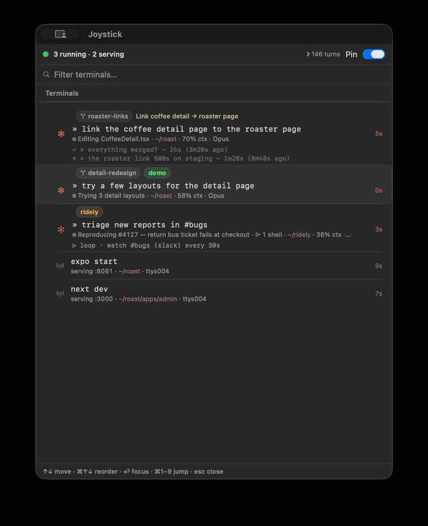

# 🕹 Joystick

**Mission control for your terminal.** A macOS dashboard that mirrors what every
Ghostty tab is doing — shell commands, Claude Code sessions, dev servers — and
gets you back to the right tab in one click. Zero workflow change: it just
observes what you already do.

<p align="center">
  
  <br>
  <sub><i>Four terminals at a glance; the amber row is an agent blocked on your input.</i></sub>
</p>

## What it shows

Every terminal becomes one row, sorted by urgency, in one of five states:

| | State | Meaning |
|---|---|---|
| ✋ | **needs you** (amber) | a prompt or agent is blocked waiting on your input |
| ▶ | **working** (blue) | a command/agent is running — with elapsed time |
| ◉ | **serving** (green) | a long-lived service (dev server) is up |
| ✓ / ✗ | **result** | finished — exit status and duration |
| • | **unseen** (blue dot) | a result you haven't looked at yet |

Click any row to jump straight to that Ghostty tab. Closing a tab is the only
"dismiss" — Joystick is a live mirror of your terminals, never an inbox to
manage.

It understands Claude Code sessions natively (each session is one row, its
prompts collapse into history) and tells you the moment one is blocked on a
permission prompt or question — so an agent never sits waiting unnoticed.

## How it works

Four small layers; the event log is the only shared state.

```
shell / Claude hooks  →  ~/.local/state/joystick/events.jsonl  →  menubar app
   (emitters)               (append-only JSONL, the source)        (viewer)
```

- **Emitters** — zsh `preexec`/`precmd` hooks and Claude Code hooks append
  `start`/`end`/`waiting` events. Tiny, stateless, fail-silent.
- **Event log** — one open JSONL file. Anything can emit to it (CI, webhooks,
  a Makefile), which is how Joystick grows beyond the terminal.
- **Viewer** — a native SwiftUI menubar app reads the log and renders the rows.
- **Focus** — clicking a row drives Ghostty via AppleScript to focus the exact
  surface (or reopen it at the right directory if the tab is gone).

## Requirements

- **macOS 14** (Sonoma) or later
- **[Ghostty](https://ghostty.org)** — click-to-focus and jump-to-tab are Ghostty-specific
- **zsh** — for shell-command tracking (Claude tracking works in any shell)
- **[Claude Code](https://claude.com/claude-code)** — optional; powers the agent-session rows
- **jq** — for the Claude-hook setup (Homebrew installs it for you)

## Install

```sh
brew install --cask kishan-ptl/tap/joystick
```

No Homebrew? Download `Joystick-<version>.dmg` from the
[latest release](https://github.com/kishan-ptl/joystick/releases/latest) and drag
it to Applications. The app is signed and notarized — it opens with no Gatekeeper
warning.

Then one click wires it up:

1. **Open Joystick.** A *Connect Joystick* panel appears on first launch.
2. **Click Enable.** It wires the zsh hook and Claude Code hooks into your shell
   and `~/.claude/settings.json` — idempotent, and it backs up every file it
   edits. No terminal, no pasting.
3. **Open a new terminal tab** and run something (`sleep 20`) — it shows up in
   Joystick. The first time you jump to a tab, macOS asks permission for Joystick
   to control Ghostty; allow it — that's what powers click-to-focus.

Prefer to wire it by hand, or want to see exactly what changes first? See
[`INSTALL.md`](INSTALL.md). To unwire later:
`~/.config/joystick/install.sh uninstall` (and `brew uninstall --cask joystick`
to remove the app).

## Privacy

Joystick records the commands you run, so trust is the product: **100% local,
no network, ever.** One `chmod 600` log, excluded from Time Machine, with
commands sanitized before they're written. Read the full story — including how
to exclude directories or log command-heads only — in
[`PRIVACY.md`](PRIVACY.md).

## Status

Early but real: signed, notarized, and installable via Homebrew — built and
dogfooded daily on Ghostty + zsh + macOS. Shell-command tracking is zsh-only for
now (bash and fish are on the roadmap); Claude-session tracking works in any
shell. Roadmap, design principles, and the full decision history live in
[`NOTES.md`](NOTES.md).
